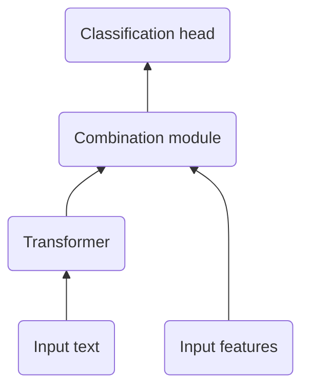

# Exploring Multimodal Models for Humor Recognition in Portuguese

This repository contains the experiments and results for the paper "Exploring Multimodal Models for Humor Recognition in Portuguese" accepted to the [16th International Conference on Computational Processing of Portuguese (PROPOR 2024)](https://propor2024.citius.gal/).

The main focus of this paper is to explore multimodal approaches in Humor Recognition by combining textual and explicit features. According to the architecture shown below.



## How to run

This project is available as a python module to make installation and re-use easier.

Using Pipenv, just run:

```
pipenv install
```

If you prefer to use pip, run:

```
pip install -r requirements.txt
pip install .
```

## Repository organization

The repository is organized as follows:

```
multimodal-humor-recognition
├───results [Final prediction files and images used in the paper]
├───scripts [Jupyter notebooks of the experiments]
└───src [Multimodal models implementation]
```

## How to cite
```bibtex
@inproceedings{InacioCaseli2020,
  title = {Word {{Embeddings}} at {{Post-Editing}}},
  booktitle = {Proceedings of the 16th International Conference on Computational {{Processing}} of the {{Portuguese Language}}},
  author = {In{\'a}cio, Marcio Lima and Gon{\c c}alo Oliveira, Hugo},
  year = {2024},
  note = {Accepted paper to be published}
}
```

